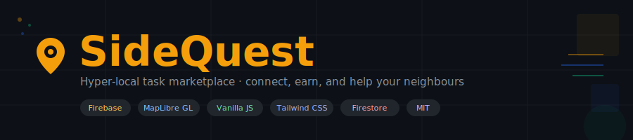
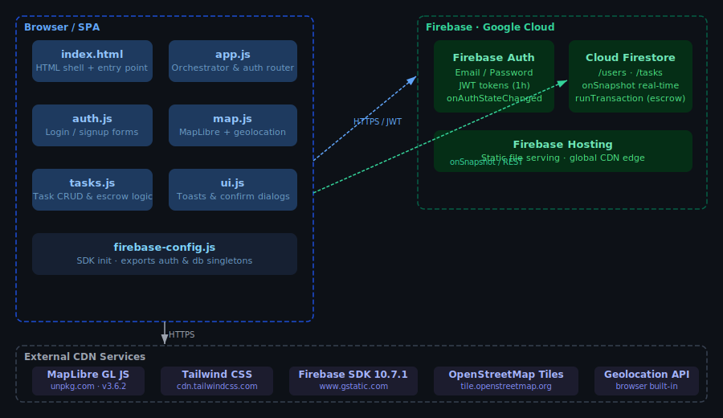
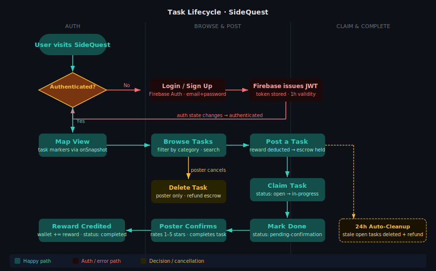

<p align="center">
  
</p>

<p align="center">
  
  
  
  
  
  
  
</p>

**SideQuest is a hyper-local task marketplace where neighbours post small jobs, claim each other's tasks, and exchange a real-time ₹ reward — all without leaving the browser tab.**

---

## What even is this?

SideQuest is a real-time web app that lets people in the same neighbourhood post and complete small tasks for each other — think "walk my dog for ₹50", "grab groceries on your way home", or "help me move a couch". You open the map, you see pins near you, you tap one and get to work. The reward sits in escrow the moment a task is posted and lands in your wallet the moment the poster confirms it's done. No middleman, no app store install, no nonsense.

It's aimed at anyone who wants to earn a little extra doing things they'd do anyway, and at anyone who needs a quick pair of hands without hiring a professional service. The whole thing runs as a static site on Firebase Hosting — no server, no backend bill, no deployment pipeline required.

## Why does this exist?

Most task platforms are overkill for small neighbourhood jobs. They charge fees, require identity verification for anything, and take days to pay out. SideQuest takes the opposite approach: a frictionless prototype built entirely in the browser with Firebase as the only backend. It proves that a real-time escrow marketplace with location-aware task discovery can run as a zero-build static app. The escrow is enforced by Firestore security rules and atomic transactions, not by a custom server, which keeps the codebase tiny and the hosting costs at zero.

## Features

- **Real-time task map** — Task markers appear and disappear on a live MapLibre GL map the instant someone posts or removes a task.
- **Escrow wallet** — Reward funds are atomically deducted from the poster's wallet on post and credited to the assignee's wallet on completion — all inside Firestore transactions.
- **Full task lifecycle** — Tasks move through `open → in-progress → pending-confirmation → completed` states with strict Firestore security rules enforcing each transition.
- **1–5 star rating system** — Posters rate assignees after confirming completion; ratings accumulate as a running average on the user's profile.
- **Category filters and search** — Filter tasks by Help / Delivery / Social / Other, or search by title and description in real time.
- **User profiles and stats** — Each user has a wallet balance, tasks-posted count, tasks-completed count, and an average rating badge.
- **Zero build step** — Clone and serve; no npm install, no bundler, no CI pipeline required for local development.
- **24-hour stale task cleanup** — Open tasks older than 24 hours are automatically deleted and their escrowed reward refunded.

## Architecture

SideQuest is a client-side Single-Page Application. There is no custom backend — Firebase Authentication issues JWTs, Cloud Firestore handles all data and enforces business rules via security rules, and Firebase Hosting serves the static files. The JS modules communicate directly with Firebase SDKs loaded from CDN, and MapLibre GL JS renders OpenStreetMap raster tiles for the interactive map.

<p align="center">
  
</p>

## How it works

When a user opens the app, `app.js` fires an `onAuthStateChanged` listener. If they are not logged in, they see the auth screen; `auth.js` handles the Firebase Auth calls. Once authenticated, `initMap()` spins up the MapLibre map and `listenForTasks()` attaches a Firestore `onSnapshot` query that streams open tasks in real time. Posting a task runs a Firestore transaction that deducts the reward from the poster's wallet and creates the task document in a single atomic write. Completing a task runs a second transaction that flips the task status to `completed` and credits the reward to the assignee's wallet, all enforced by security rules that verify task state transitions and ownership before allowing writes.

<p align="center">
  
</p>

## Tech stack

| Technology | Role | Why we picked it |
|---|---|---|
| **Vanilla JS (ES Modules)** | Application logic | No build tooling needed; native browser modules ship everywhere modern |
| **Firebase Authentication** | Email/password auth, JWT session management | Free tier, works out of the box, integrates directly with Firestore rules |
| **Cloud Firestore** | Real-time NoSQL database, escrow via transactions | `onSnapshot` gives WebSocket-like live updates with zero infrastructure |
| **Firestore Security Rules** | Server-side authorisation for all writes | Eliminates the need for a custom API — rules are code-reviewed and version-controlled |
| **MapLibre GL JS 3.6.2** | Interactive map rendering | Open-source (no Mapbox token), great performance, CDN-hosted |
| **OpenStreetMap tiles** | Map base layer | Free, globally available, no API key |
| **Tailwind CSS (CDN)** | Utility-first styling | No build step required when loaded from CDN; rapid iteration |
| **Firebase Hosting** | Static file serving | Free SSL, global CDN, `firebase deploy` in one command |

## Getting started

### Prerequisites

- A **modern web browser** (Chrome, Firefox, Edge, Safari — not IE)
- A **local HTTP server** — Python, Node.js `http-server`, or VS Code Live Server (you cannot open `index.html` directly due to ES module CORS restrictions)
- A **Firebase project** with Email/Password Authentication and Cloud Firestore enabled ([create one free here](https://console.firebase.google.com/))
- **Firebase CLI** (optional, for deploying rules and hosting): `npm install -g firebase-tools`

### Installation

```bash
# 1. Clone the repository
git clone https://github.com/Kaelith69/SideQuest.git
cd SideQuest
```

### Configuration

Open `js/firebase-config.js` and replace the placeholder values with your Firebase project's configuration (found in Project Settings → Your apps → Web):

```javascript
// js/firebase-config.js
import { initializeApp } from "https://www.gstatic.com/firebasejs/10.7.1/firebase-app.js";
import { getAuth }        from "https://www.gstatic.com/firebasejs/10.7.1/firebase-auth.js";
import { getFirestore }   from "https://www.gstatic.com/firebasejs/10.7.1/firebase-firestore.js";

const firebaseConfig = {
    apiKey:            "YOUR_API_KEY",
    authDomain:        "your-project.firebaseapp.com",
    projectId:         "your-project-id",
    storageBucket:     "your-project.appspot.com",
    messagingSenderId: "123456789012",
    appId:             "1:123456789012:web:abc123"
};

const app = initializeApp(firebaseConfig);
export const auth = getAuth(app);
export const db   = getFirestore(app);
```

Firebase configuration fields:

| Field | Required | Description |
|---|---|---|
| `apiKey` | ✅ | Firebase Web API key |
| `authDomain` | ✅ | Firebase Auth domain (your-project.firebaseapp.com) |
| `projectId` | ✅ | Firestore project ID |
| `storageBucket` | ✅ | Firebase Storage bucket (unused in v1.0.0 but required by SDK) |
| `messagingSenderId` | ✅ | Firebase Cloud Messaging sender ID |
| `appId` | ✅ | Firebase Web app ID |

> ⚠️ Do not commit real Firebase credentials to a public repository. Consider adding `js/firebase-config.js` to `.gitignore` and using a template file for local development.

### Deploy Firestore security rules

```bash
# Login to Firebase CLI (one-time)
firebase login

# Deploy the bundled security rules
firebase deploy --only firestore:rules
```

### Running locally

```bash
# Option 1 — Python (no install required)
python -m http.server 8000

# Option 2 — Node.js http-server
npx http-server . -p 8000

# Option 3 — Node.js live-server (auto-reload on save)
npx live-server --port=8000
```

Then open **http://localhost:8000** in your browser. Allow location access when prompted for the best experience.

## Usage

### Sign up and get your starter wallet

```
1. Open http://localhost:8000
2. Click "New to SideQuest? Sign Up"
3. Enter name, email, and a password (≥ 6 characters)
4. Click "Create Account"
```

Your account is created, Firebase Auth issues a session, and a Firestore document is written at `/users/{uid}` with a **₹500 demo wallet balance**.

### Post a task

```
1. Tap the blue ＋ FAB button (bottom-right)
2. Fill in the form:
   - Title:       "Walk my dog for 30 min"
   - Category:    Help
   - Reward (₹):  50
   - Description: "Golden retriever, super friendly, just needs the park loop."
3. Tap "Post Task"
```

The ₹50 reward is atomically deducted from your wallet and held in escrow. A marker appears on the map at your current location.

### Find and claim a task

```
1. Browse the map or use the search bar at the top
2. Tap a task marker → task detail sheet slides up
3. Review the title, description, reward, and poster's rating
4. Tap "I'll do it!" to claim the task
```

The task `status` flips to `in-progress` and appears under **My Tasks → Claimed**.

### Mark done and get paid

```
1. Go to My Tasks → Claimed tab
2. Find your in-progress task → tap "Mark as Done"
3. Wait for the poster to confirm in their "Pending" tab
4. When they confirm and rate, your wallet is credited atomically
```

### Filter and search

```
- Tap category chips (Help / Delivery / Social / Other) to filter the task list
- Type in the search bar to match against title and description in real time
```

## Use cases

- **Busy professionals** who need small errands done nearby — grocery runs, parcel pickups, dog walks — and are happy to pay a small reward rather than wait.
- **Students** looking to earn a few extra rupees in their spare time by helping neighbours with tasks that only take 20–30 minutes.
- **Housing society admins** who want to pilot a neighbourhood task-exchange without setting up or paying for a commercial platform.
- **Developers** exploring Firebase + MapLibre architectures who want a working, zero-build reference implementation with real escrow logic and security rules.
- **Hackathon prototypers** who need a real-time marketplace scaffold they can fork, re-theme, and deploy in an afternoon.

## Project structure

```
SideQuest/
├── index.html              # HTML shell — single page, all views inline
├── firebase.json           # Firebase Hosting + Firestore deploy config
├── firestore.rules         # Server-side Firestore security rules
├── LICENSE                 # MIT license
│
├── js/
│   ├── firebase-config.js  # Firebase SDK init; exports auth & db singletons
│   ├── app.js              # Entry point; auth state router; boot sequence
│   ├── auth.js             # Login / signup / logout form handlers
│   ├── map.js              # MapLibre GL map, geolocation, task markers
│   ├── tasks.js            # Task CRUD, real-time listener, escrow logic, UI state
│   └── ui.js               # Shared utilities: showToast(), showConfirm()
│
├── styles/
│   ├── main.css            # Custom CSS (animations, map marker styles, safe-area)
│   └── tailwind.css        # Tailwind CSS config (used with CDN build)
│
├── docs/
│   └── assets/
│       ├── banner.svg      # Project banner (this file)
│       ├── architecture.svg# System architecture diagram
│       └── flow.svg        # Task lifecycle flow diagram
│
├── wiki/                   # Full documentation (synced to GitHub Wiki via CI)
│   ├── Home.md
│   ├── Architecture.md
│   ├── Database-Schema.md
│   ├── Installation-Guide.md
│   ├── Usage.md
│   ├── Roadmap.md
│   └── ...
│
└── .github/
    └── workflows/
        └── wiki-sync.yml   # Auto-syncs wiki/ folder to GitHub Wiki on push
```

## API reference

### `auth.js` — Authentication

| Function | Signature | Description |
|---|---|---|
| `logout` | `async logout() → void` | Signs out the current Firebase Auth user |

Login and signup are handled by DOM form event listeners (not exported functions). To trigger programmatically, call Firebase Auth SDK methods directly:

```javascript
import { signInWithEmailAndPassword } from "https://www.gstatic.com/firebasejs/10.7.1/firebase-auth.js";
import { auth } from './firebase-config.js';

await signInWithEmailAndPassword(auth, email, password);
```

---

### `map.js` — Map & Geolocation

| Function | Signature | Description |
|---|---|---|
| `initMap` | `initMap(user) → void` | Initialises the MapLibre map and geolocation watcher. Idempotent (safe to call twice). |
| `addMarker` | `addMarker(task, onClick) → Marker` | Adds a category-emoji task marker at `task.location.{lat,lng}`. Returns the MapLibre Marker. |
| `clearMarkers` | `clearMarkers() → void` | Removes all task markers from the map. |
| `getMapCenter` | `getMapCenter() → {lng, lat}` | Returns the current map centre coordinates. |
| `calculateDistance` | `calculateDistance(lat1, lon1, lat2, lon2) → number` | Returns the Haversine distance in kilometres between two points. |
| `flyToUserLocation` | `flyToUserLocation() → void` | Animates the map to the user's last known location. |
| `onUserLocationUpdate` | `onUserLocationUpdate(callback) → void` | Registers a callback that fires whenever the user's GPS position changes. Fires immediately if a position is already known. |
| `currentUserLocation` | `{lat, lng} \| null` | Exported module-level variable holding the latest user position. |

**Example — distance filter:**

```javascript
import { calculateDistance, currentUserLocation } from './map.js';

const taskLat = 19.0760, taskLng = 72.8777;
if (currentUserLocation) {
  const km = calculateDistance(
    currentUserLocation.lat, currentUserLocation.lng,
    taskLat, taskLng
  );
  console.log(`Task is ${km.toFixed(1)} km away`);
}
```

---

### `tasks.js` — Task operations

Task operations are driven by UI event listeners internally, but the key Firestore helpers follow this pattern:

| Operation | Firestore call | Status transition |
|---|---|---|
| Create task | `addDoc` inside `runTransaction` | — → `open` (with escrow debit) |
| Claim task | `updateDoc` | `open` → `in-progress` |
| Mark done | `updateDoc` | `in-progress` → `pending-confirmation` |
| Confirm + rate | `updateDoc` + wallet `runTransaction` | `pending-confirmation` → `completed` |
| Delete task | `deleteDoc` inside `runTransaction` | `open` → deleted (with escrow refund) |

**Task document shape:**

```javascript
{
  title:       string,          // 3–100 chars
  description: string,          // 5–1000 chars
  category:    "Help" | "Delivery" | "Social" | "Other",
  reward:      { amount: number, currency: "INR" },
  status:      "open" | "in-progress" | "pending-confirmation" | "completed",
  location:    { lat: number, lng: number },
  poster:      { id: string, name: string, avatar: string },
  assignee:    { id: string, name: string } | null,
  createdAt:   Timestamp,
  completedAt: Timestamp | null,
  rating:      number | null     // 1–5, set on completion
}
```

---

### `ui.js` — Shared utilities

| Function | Signature | Description |
|---|---|---|
| `showToast` | `showToast(message, type?) → void` | Shows a dismissible toast. `type` accepts `'info'` (default), `'success'`, or `'error'`. |
| `showConfirm` | `showConfirm(title, message, onConfirm) → void` | Opens a confirmation modal and calls `onConfirm()` if the user accepts. Falls back to `window.confirm()` if the modal DOM element is missing. |

```javascript
import { showToast, showConfirm } from './ui.js';

showToast('Task claimed!', 'success');

showConfirm(
  'Delete task?',
  'This will refund your escrowed reward.',
  () => deleteTask(taskId)
);
```

## Development

### Running tests

There are no automated tests in the current codebase (adding Playwright E2E coverage is on the roadmap). Manual testing steps are in [wiki/Development-Guide.md](wiki/Development-Guide.md).

### Deploying to Firebase Hosting

```bash
# Deploy everything (hosting + firestore rules)
firebase deploy

# Deploy only the security rules
firebase deploy --only firestore:rules

# Deploy only the hosted static files
firebase deploy --only hosting
```

### Contributing

Contributions are welcome! Check out [CONTRIBUTING.md](CONTRIBUTING.md) for branch naming, commit message conventions, and the PR review process. The full coding standards and development workflow live in [wiki/Contributing.md](wiki/Contributing.md). For questions, open a [GitHub Discussion](https://github.com/Kaelith69/SideQuest/discussions) before spending time on a big feature — it's good to check it aligns with the roadmap.

## Roadmap

- [x] Email/password auth with ₹500 demo wallet on signup
- [x] Interactive map with real-time task markers (MapLibre GL JS)
- [x] Task creation with escrow debit and atomic reward transfer
- [x] Full task lifecycle: open → in-progress → pending-confirmation → completed
- [x] 1–5 star rating system with running average
- [x] Category filter chips and full-text search
- [x] User profile with wallet balance and stats
- [x] Mobile-first responsive layout with safe-area insets
- [x] Firestore security rules — auth-gated, state-transition-enforced
- [x] 24-hour stale task auto-cleanup with escrow refund
- [ ] In-app chat between poster and assignee
- [ ] Push notifications (Firebase Cloud Messaging)
- [ ] Photo attachments (up to 3 images per task)
- [ ] Task editing before a task is claimed
- [ ] Distance-based filter (e.g. "within 2 km")
- [ ] Firebase App Check to block unauthorised API usage
- [ ] Geo-query optimisation with geohash compound indexes
- [ ] Real payment gateway (Razorpay / Stripe) replacing demo ₹
- [ ] Playwright E2E test suite and CI/CD pipeline

See [wiki/Roadmap.md](wiki/Roadmap.md) for the full versioned roadmap and long-term vision.

## License

MIT — do whatever you want with it, just don't blame us. See [LICENSE](LICENSE) for the full text.

---

<p align="center">
  Made with ☕ and mild existential dread · <a href="https://github.com/Kaelith69">Kaelith69</a>
</p>
